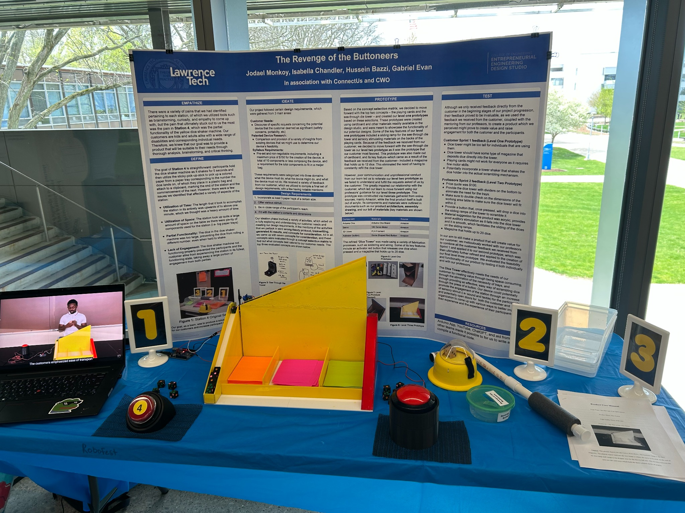
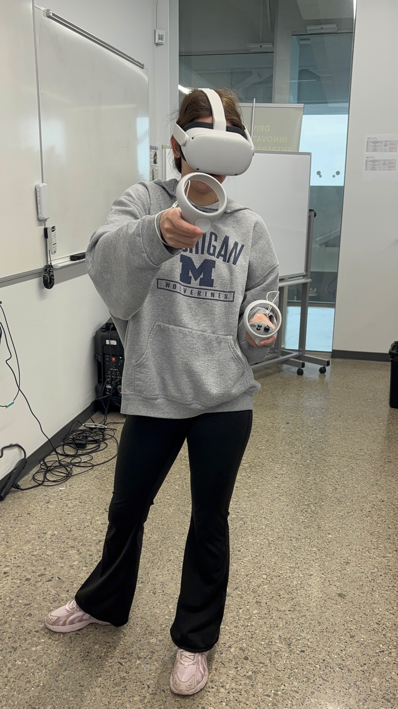

# Isabella Chandler Portfolio (forest / lab redesign)

This version of the site was rebuilt to feel:
- more aesthetic
- more professional
- more personal
- less flat / less bare
- more focused on projects and technical interests

## Main files
- `index.html` = homepage
- `photos.html` = photo gallery page
- `style.css` = styling
- `script.js` = project case-study popups + mobile menu + forest ambience + print button
- `assets/resume.pdf` = resume file

## What was added
- forest / greenhouse / soft-lab visual style
- better homepage hero with both professional portraits
- blue-backdrop portrait placed behind the black-outfit portrait in the main hero area
- quick links for Resume PDF, Portfolio PDF, LinkedIn, and Handshake
- currently interested in section
- coursework section
- better project previews
- more detailed project case-study modals
- full photo page with all newly uploaded photos
- optional ambient forest-sound button

## IMPORTANT: how the "Portfolio PDF" button works
The Portfolio PDF button uses `window.print()`.
That means:
1. open the website
2. click **Portfolio PDF**
3. your browser print window opens
4. choose **Save as PDF**

So it is a quick built-in way to save the site as a PDF.

## How to update the resume
Replace this file:
`assets/resume.pdf`

Keep the same filename if you want the Resume button to keep working automatically.

## How to change the project preview images
In `index.html`, each project card uses an image line like:
```html

```
To change the preview image:
1. put your new image into the matching project folder inside `assets/projects/...`
2. change the `src=` path in `index.html`

## How to change the full project case-study info
Open `script.js`.
Each project has a block like:
```js
buttoneers: {
  title: 'The Revenge of the Buttoneers',
  category: 'Entrepreneurial Engineering Design',
  subtitle: '...',
  hero: 'assets/projects/buttoneers/preview.jpg',
  gallery: [...],
  overview: '...',
  challenge: [...],
  approach: [...],
  skills: [...],
  employerTakeaways: [...]
}
```

You can update:
- title
- subtitle
- images
- overview
- challenge bullets
- approach bullets
- skills
- employer takeaways

## How to change the photo captions
Open `photos.html`.
Every photo uses this structure:
```html
<figure class="gallery-item">
  
  <figcaption>Caption coming soon.</figcaption>
</figure>
```

Just replace:
```html
<figcaption>Caption coming soon.</figcaption>
```
with your own caption.

Example:
```html
<figcaption>Trying out VR during class.</figcaption>
```

## How to add more photos later
1. place the new photo in `assets/photos/`
2. copy one of the `<figure class="gallery-item">...</figure>` blocks in `photos.html`
3. update the image filename and caption

## How to update your interests or coursework later
- `Currently interested in` section is in `index.html`
- `Coursework` section is also in `index.html`

These are easy to edit directly in the HTML.

## GitHub Pages reminder
For GitHub Pages to work correctly:
- `index.html` must stay in the main/root folder of the site
- `style.css` and `script.js` should stay next to it
- the `assets` folder should stay together with them

If you want to upload this version to GitHub, replace the old files with the contents of this folder.
